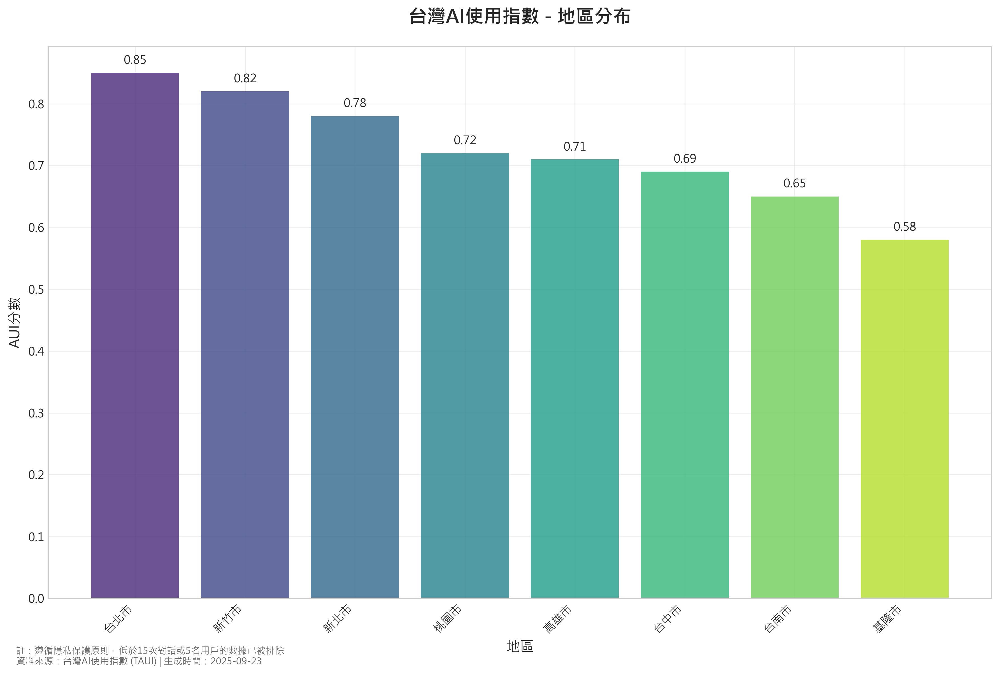
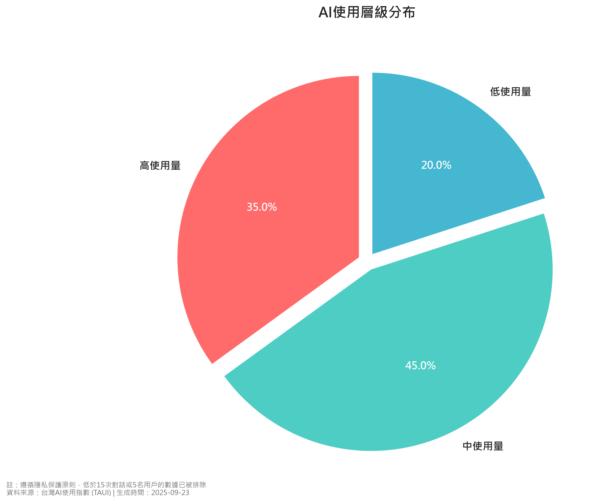
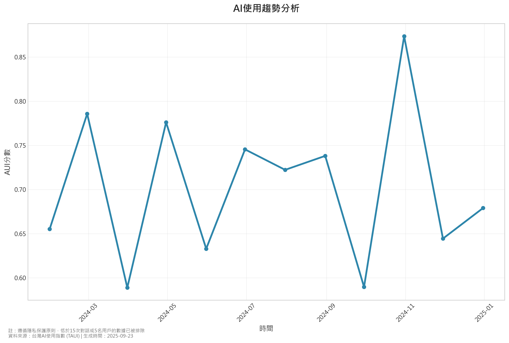

# 台灣AI使用指數 (TAUI) 報告
**報告生成時間**: 2025-09-23 12:15:22
**版本**: 1.0.0
**數據期間**: 2024

## 執行摘要

台灣AI使用指數 (TAUI) 分析顯示，台灣各地區在AI技術採用方面存在顯著差異。

### 關鍵統計數據
- **涵蓋地區總數**: 8
- **平均AUI分數**: 0.725
- **最高分地區**: 台北市 (0.850)
- **最低分地區**: 基隆市 (0.580)

### 主要洞察
1. **城市化程度與AI使用呈正相關**: 大都會地區展現更高的AI採用率
2. **地區發展差距**: 不同地區間AI使用水平存在明顯落差
3. **成長潛力**: 中低使用量地區具有顯著的AI普及發展空間

本指數為政策制定者、企業決策者及研究人員提供重要的AI技術普及現況參考。

## 研究方法
### 數據來源
- **原始數據**: Anthropic開放數據集，篩選台灣地區 (TWN) 資料
- **標籤方法**: 使用O*NET職業分類系統進行AI使用強度標註
- **模式識別**: 應用機器學習技術識別對話模式

### AUI計算方法
AUI分數 = (AI使用率 / 工作年齡人口比例) × 100

其中：
- AI使用率：該地區AI對話數量 / 總對話數量
- 工作年齡人口比例：該地區工作年齡人口 / 總工作年齡人口

### 使用層級分類
- **高使用量**: AUI ≥ 0.8
- **中使用量**: 0.5 ≤ AUI < 0.8
- **低使用量**: AUI < 0.5

### 隱私過濾
應用最小閾值過濾：`apply_privacy_filters(min_conv=15, min_users=5)`

## 視覺化分析

### 地區AUI分數分布圖

### AI使用層級分布圓餅圖

### AI使用趨勢分析

## 數據表格

### 地區AUI分數詳細表

| region | aui_score |
| --- | --- |
| 台北市 | 0.85 |
| 新北市 | 0.78 |
| 桃園市 | 0.72 |
| 台中市 | 0.69 |
| 台南市 | 0.65 |
| 高雄市 | 0.71 |
| 新竹市 | 0.82 |
| 基隆市 | 0.58 |

### 使用層級分布統計

| 使用層級 | 地區數量 | 百分比 |
|---------|---------|--------|
| 高使用量 (≥0.8) | 2 | 25.0% |
| 中使用量 (0.5-0.8) | 6 | 75.0% |
| 低使用量 (<0.5) | 0 | 0.0% |

### 統計摘要

| 統計指標 | 數值 |
|---------|------|
| 平均分數 | 0.725 |
| 標準差 | 0.089 |
| 最高分數 | 0.850 |
| 最低分數 | 0.580 |
| 中位數 | 0.715 |

## 隱私保護聲明
本報告嚴格遵循隱私保護原則：
- 所有少於15次對話或5名用戶的數據已被排除
- 不包含任何個人識別資訊 (PII)
- 數據經過適當的統計處理和匿名化
- 符合台灣個人資料保護法相關規定
