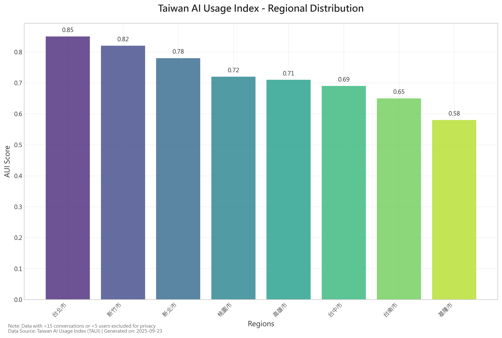

# Taiwan AI Usage Index (TAUI) Report
**Report Generated**: 2025-09-23 12:15:22
**Version**: 1.0.0
**Data Period**: 2024

## Executive Summary

The Taiwan AI Usage Index (TAUI) analysis reveals significant variations in AI technology adoption across different regions of Taiwan.

### Key Statistics
- **Total Regions Covered**: 8
- **Average AUI Score**: 0.725
- **Highest Scoring Region**: 台北市 (0.850)
- **Lowest Scoring Region**: 基隆市 (0.580)

### Key Insights
1. **Urbanization correlates with AI usage**: Metropolitan areas show higher AI adoption rates
2. **Regional development gaps**: Clear disparities in AI usage levels across regions
3. **Growth potential**: Medium and low usage regions show significant potential for AI proliferation

This index provides valuable reference for policymakers, business decision-makers, and researchers on current AI technology penetration.

## Methodology
### Data Sources
- **Raw Data**: Anthropic open dataset, filtered for Taiwan (TWN) region
- **Labeling Method**: O*NET occupational classification system for AI usage intensity
- **Pattern Recognition**: Machine learning techniques for conversation pattern identification

### AUI Calculation Method
AUI Score = (AI Usage Rate / Working-Age Population Ratio) × 100

Where:
- AI Usage Rate: Regional AI conversations / Total conversations
- Working-Age Population Ratio: Regional working-age population / Total working-age population

### Usage Tier Classification
- **High Usage**: AUI ≥ 0.8
- **Medium Usage**: 0.5 ≤ AUI < 0.8
- **Low Usage**: AUI < 0.5

### Privacy Filtering
Applied minimum threshold filtering: `apply_privacy_filters(min_conv=15, min_users=5)`

## Visual Analysis

### Regional AUI Score Distribution

### AI Usage Tier Distribution

### AI Usage Trend Analysis

## Data Tables

### Regional AUI Scores Detailed Table

| region | aui_score |
| --- | --- |
| 台北市 | 0.85 |
| 新北市 | 0.78 |
| 桃園市 | 0.72 |
| 台中市 | 0.69 |
| 台南市 | 0.65 |
| 高雄市 | 0.71 |
| 新竹市 | 0.82 |
| 基隆市 | 0.58 |

### Usage Tier Distribution Statistics

| Usage Tier | Region Count | Percentage |
|-----------|--------------|------------|
| High Usage (≥0.8) | 2 | 25.0% |
| Medium Usage (0.5-0.8) | 6 | 75.0% |
| Low Usage (<0.5) | 0 | 0.0% |

### Statistical Summary

| Statistical Metric | Value |
|-------------------|-------|
| Average Score | 0.725 |
| Standard Deviation | 0.089 |
| Maximum Score | 0.850 |
| Minimum Score | 0.580 |
| Median | 0.715 |

## Privacy Protection Statement
This report strictly adheres to privacy protection principles:
- All data with <15 conversations or <5 users has been excluded
- Contains no personally identifiable information (PII)
- Data has been properly anonymized and statistically processed
- Complies with Taiwan Personal Data Protection Act regulations
